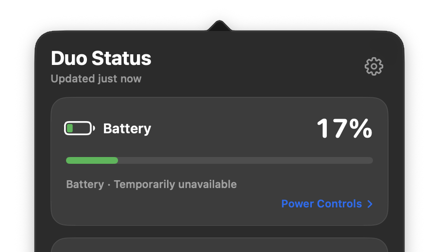
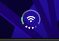
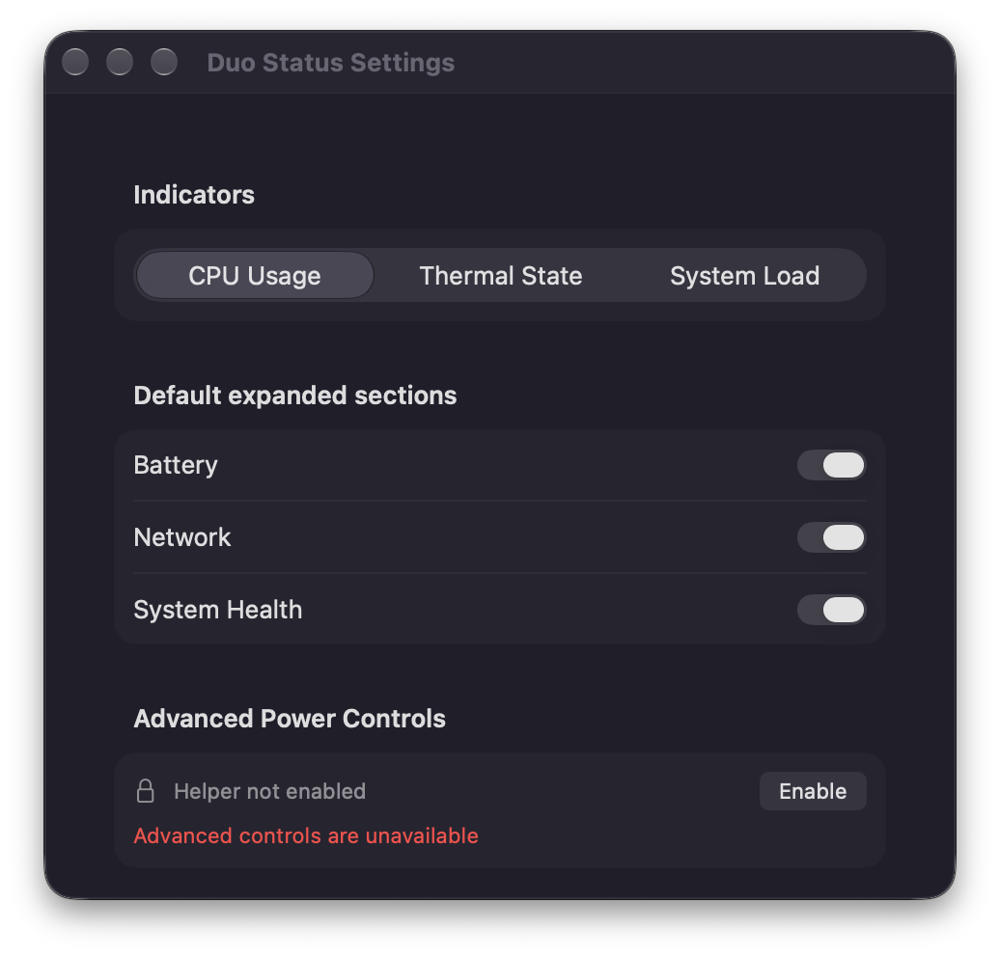

# Duo Status

Duo Status 是一个轻量的 macOS 菜单栏状态聚合工具。它把电池、网络和系统健康状态压缩到一个组合图标里，点击后可以查看详情、调整显示偏好，并在设备支持时展示能源模式能力。



> 当前发布：`v2.0.0` · Apple silicon · macOS 13+

## 你可以用它做什么

- 在菜单栏快速查看电池、电源来源、网络类型、Wi-Fi 名称和信号强度。
- 查看 CPU 使用率、系统负载和系统热状态，并把其中一个指标映射到健康指示点。
- 点击菜单栏图标打开 SwiftUI 弹出面板；右键打开设置或退出应用。
- 通过系统设置处理 Wi-Fi 连接，应用本身不读取或保存 Wi-Fi 密码。
- 在能力可用并完成授权时读取或尝试切换能源模式；辅助进程不可用时安全降级为只读。
- 使用简体中文或英文界面，其他系统语言回退英文。

## 使用截图

### 菜单栏状态



### 弹出面板


### 设置



截图来自本项目在 Apple silicon Mac 上的实际运行构建，不是设计稿。不同电池、电源、网络和系统语言会让具体数值有所不同。

## 下载和使用

### 方式一：下载发布 DMG

前往 [v2.0.0 Releases](https://github.com/lliooly/mac-duo-status/releases/tag/v2.0.0)，下载：

`DuoStatus-v2.0.0-macos-arm64-unsigned.dmg`

这是为了节省 Developer ID 和 notarization 成本而提供的 **Apple silicon、无 Developer ID 包**，不是经过 Apple 公证的正式安装包。首次打开时 Gatekeeper 提示是预期行为：

1. 打开 DMG，把 `mac-duo-status.app` 拖到“应用程序”。
2. 在 Finder 中对应用右键，选择“打开”，再确认打开。
3. 如果系统仍然拦截，到“系统设置 → 隐私与安全性”底部点击“仍要打开”。

也可以在确认来源可信后执行：

```sh
xattr -dr com.apple.quarantine /Applications/mac-duo-status.app
```

该版本适合个人测试和手动分发，不应被当作免提示、免授权的正式安装包。能源模式 helper 需要额外的签名和系统授权；未满足条件时应用仍保持只读。Widget 使用 App Group 共享快照，若目标系统拒绝未授权容器访问，建议使用下面的 Xcode 构建方式。

### 方式二：自己用 Xcode 构建

1. 安装完整 Xcode。
2. 克隆仓库并打开 `mac-duo-status.xcodeproj`。
3. 选择 `mac-duo-status` Scheme。
4. 在 Signing & Capabilities 中为主应用、Widget 和
   `DuoStatusPowerHelper` 选择同一个 Apple Development Team，并保持
   Automatically manage signing。
5. 在 Apple silicon Mac、macOS 13 或更高版本上运行。
6. 在“桌面与菜单栏设置”中把 Duo Status Widget 加到桌面或通知中心。

从源码构建的开发签名版本可以启用高级电源控制；这是给当前 Mac 自用的
版本，不等于 Developer ID 分发签名。首次点击 `Enable` 时，系统可能要求
批准辅助进程。若仍显示“等待系统批准”，请按 macOS 的系统设置提示完成
批准后重新打开应用。

命令行运行：

```sh
./script/build_and_run.sh
```

这个脚本会停止旧的 Duo Status 进程，读取项目配置中的开发团队，使用
Apple Development 身份和 Xcode 自动签名构建 Debug 版本，并启动新版本。
如果你需要覆盖项目配置中的 Team，可以显式传入：

```sh
DEVELOPMENT_TEAM=<你的 Team ID> ./script/build_and_run.sh --verify
```

还支持：

```sh
./script/build_and_run.sh --verify
./script/build_and_run.sh --logs
./script/build_and_run.sh --telemetry
```

## 从源码打包

构建 Apple silicon 无签名 Release 包：

```sh
./scripts/package-unsigned-release.sh
```

产物写入 `dist/`：

- `DuoStatus-v2.0.0-macos-arm64-unsigned.dmg`
- `DuoStatus-v2.0.0-macos-arm64-unsigned.zip`
- 两个产物各自对应的 `.sha256` 校验文件

如果需要生成其他版本，可以传入版本号；build number 默认是 `3`：

```sh
BUILD_NUMBER=4 ./scripts/package-unsigned-release.sh 2.0.1
```

## 开发

### 环境要求

- macOS 13 或更高版本。
- Apple silicon Mac 是当前优先支持目标；Intel Mac 不在当前支持范围内。
- 完整 Xcode 和对应的 macOS SDK。

### 常用命令

```sh
# Debug 构建并运行
./script/build_and_run.sh

# 单元测试
xcodebuild \
  -project mac-duo-status.xcodeproj \
  -scheme mac-duo-status \
  -destination 'platform=macOS' \
  test

# 检查所有提交前的空白问题
git diff --check
```

### 目录职责

| 目录 | 作用 |
| --- | --- |
| `mac-duo-status/App` | 应用入口和场景配置 |
| `mac-duo-status/State` | 状态快照、刷新任务和偏好设置 |
| `mac-duo-status/Providers` | 电池、网络、系统健康和能源模式读取 |
| `mac-duo-status/UI` | 菜单栏弹出面板、设置和状态区域 |
| `mac-duo-status/Platform` | AppKit 状态栏、系统设置和 helper 通信 |
| `mac-duo-status/Widget` | Widget 共享快照和图标渲染 |
| `DuoStatusWidget` | WidgetKit 扩展目标 |
| `DuoStatusPowerHelper` | 能源模式辅助进程 |
| `scripts` | 发布和打包脚本 |
| `docs` | 产品、架构、测试和发布文档 |

更详细的说明：

- [产品规格](docs/product-spec.md)
- [架构说明](docs/architecture.md)
- [测试说明](docs/testing.md)
- [发布说明](docs/releasing.md)

## 数据、权限和限制

- 不连接服务器，不同步账号数据，不包含远程监控。
- 只读取当前 Mac 的本机状态；Wi-Fi 连接由 macOS 系统设置完成。
- 不保存 Wi-Fi 密码、管理员密码或临时授权凭证。
- 主应用不以 root 运行；能源模式写入能力依赖单独的 helper、签名和授权。
- Intel Mac、iPhone 连接、蜂窝网络状态、进程级 CPU 排名、历史图表和充电上限控制不在当前版本范围内。

## 致谢

感谢 Apple 提供的 SwiftUI、AppKit、WidgetKit、Network、CoreWLAN、IOKit 和 ServiceManagement 等系统框架；应用的图标源文件使用 Icon Composer/Xcode 资源工作流维护。

感谢所有通过 macOS 状态栏和 WidgetKit 官方文档、示例与社区讨论提供经验的开发者。

## 许可证

当前仓库尚未包含 `LICENSE` 文件，因此暂不宣称具体的开源许可证。除非仓库后续补充许可证，否则请不要默认将代码或资源用于再分发。
